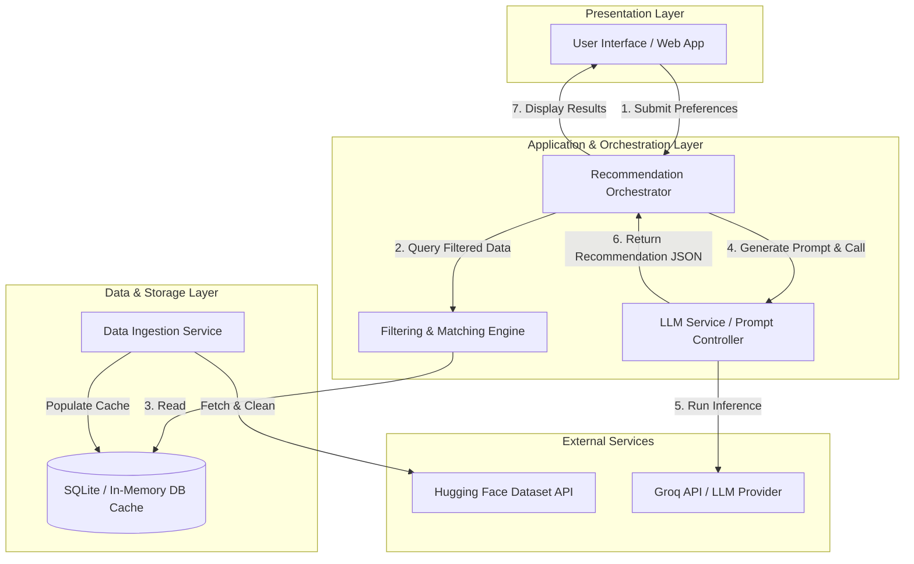
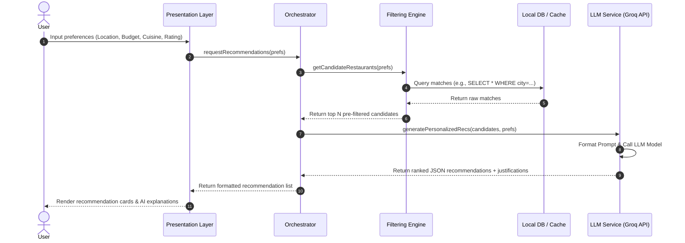

# Architectural Design Document: AI-Powered Restaurant Recommendation System

This document outlines the software architecture, component design, data flow, and interface specifications for the AI-Powered Restaurant Recommendation System.

---

## 1. High-Level Architecture Overview

The system follows a **Layered Architecture Pattern** combined with a **Service-Oriented Approach** for external API integrations (Hugging Face Datasets & Large Language Model API). 

### System Component Diagram



---

## 2. Component Detailed Design

### 2.1. Ingestion Service (`DataIngestionService`)
Responsible for bootstrapping the application by loading, parsing, and cleaning the Zomato dataset.
* **Responsibilities:**
  * Download the raw dataset from Hugging Face: `ManikaSaini/zomato-restaurant-recommendation`.
  * Deduplicate records, normalize text fields (e.g., lowercasing cuisines, trimming locations).
  * Parse cost attributes into numeric categories (Low, Medium, High).
  * Persist the cleaned dataset into `LocalDB` for low-latency queries.

### 2.2. Filtering Engine (`RestaurantFilteringEngine`)
Performs deterministic filtering before LLM reasoning to ensure cost-efficiency and limit prompt context size.
* **Responsibilities:**
  * Match user location and desired cuisine.
  * Resolve budget tier labels (`low`, `medium`, `high`) to numeric cost caps (Low ≤ ₹300, Medium ≤ ₹800, High = no limit) and filter by the resolved threshold.
  * Prune search space to top $N$ candidates (e.g., top 15-20 restaurants by rating/votes) to prevent token overflow.

### 2.3. LLM Service (`LLMService`)
Handles prompt construction, API communication, and response parsing.
* **Responsibilities:**
  * Assemble structured prompt context containing user preferences and candidate restaurants.
  * Send instructions to the LLM to rank and generate natural language justifications.
  * Enforce JSON structured output schema validation.

---

## 3. Data Flow & Sequence



---

## 4. Data Models & Schemas

### 4.1. Restaurant Record Schema
```typescript
interface Restaurant {
  id: string;
  name: string;
  location: {
    city: string;
    locality: string;
    latitude?: number;
    longitude?: number;
  };
  cuisines: string[];
  averageCostForTwo: number;
  currency: string;
  aggregateRating: number;
  votes: number;
  hasTableBooking: boolean;
  hasOnlineDelivery: boolean;
}
```

### 4.2. User Preference Input
```typescript
interface UserPreferences {
  location: string;
  budgetTier?: "low" | "medium" | "high"; // Budget tier label resolved to cost cap internally
  cuisines: string[];
  minRating: number;
  additionalNotes?: string; // e.g., "family friendly", "quiet workspace"
}
```

### 4.3. LLM Structured Output Recommendation Schema
```typescript
interface AIRecommendationResponse {
  recommendations: Array<{
    restaurantId: string;
    name: string;
    rank: number;
    suitabilityScore: number; // Percentage score
    aiExplanation: string; // The reason why it fits their preferences
    recommendedDishesSuggest?: string[];
  }>;
  summaryOfChoice: string; // General advice/comment from the AI
}
```

---

## 5. Prompt Engineering Strategy

To ensure deterministic response structures and prevent hallucinations, the system uses a **System Instruction** configuration coupled with **Few-Shot Prompting**.

### 5.1. System Instructions
> "You are an expert culinary guide and recommendation assistant. You are given a list of pre-filtered restaurant data and a user's exact preferences. Your task is to rank the top 3-5 restaurants that best suit the user's specific request. You must output your response in strict JSON matching the provided schema. Do not include markdown code block syntax inside the response body if requested in raw mode. Justify your rankings based on user location, budget, cuisine, and extra context."

### 5.2. Example Prompt Construction Template
```text
[User Preferences]
- Target Location: Delhi
- Budget Tier: Medium (up to ₹800 for two)
- Cuisines Preferred: Italian, Cafes
- Minimum Rating: 4.2
- Extra Vibe: Quiet place for reading

[Candidate Restaurants]
1. Cafe Lota | Locality: Pragati Maidan | Rating: 4.5 | Avg Cost For Two: 1200 | Cuisines: Cafe, South Indian
2. Diggin | Locality: Chanakyapuri | Rating: 4.3 | Avg Cost For Two: 1400 | Cuisines: Italian, Cafe, Continental
3. Tonino | Locality: MG Road | Rating: 4.6 | Avg Cost For Two: 3500 | Cuisines: Italian, Pizza

[Task]
Evaluate the candidates. Note that Tonino might exceed the 'Medium' budget tier. Diggin matching Italian & Cafe is a strong candidate.
Generate the ranked list in JSON format.
```

---

## 6. Non-Functional & Reliability Considerations

1. **Token Cost & Context Limit Management:**
   * Raw datasets can contain thousands of records. Injecting all of them into the prompt is cost-prohibitive.
   * **Solution:** We strictly pre-filter the database locally using traditional indexing, passing only the top 10-15 matching candidate records to the LLM.
2. **Caching Strategy:**
   * **Database Caching:** The Hugging Face dataset is downloaded once at application startup or build time, and stored in a local file-based SQLite database or JSON repository.
   * **Recommendation Caching:** Cache recommendation outputs for identical inputs (e.g., same location + cuisines + budget) for 1 hour to reduce LLM API billing.
3. **Resilience & Fallback:**
   * If the LLM API is unavailable, the system fails gracefully by displaying the pre-filtered candidates ranked solely by their database rating, with a note: *"AI explanations are currently unavailable, showing ratings-based sorting."*
