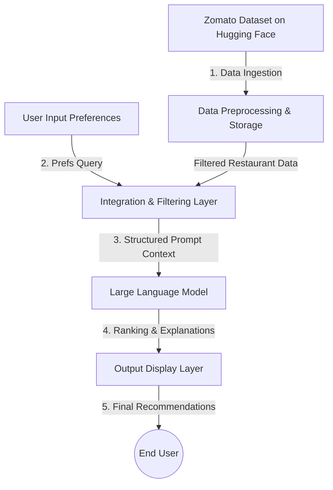

# AI-Powered Restaurant Recommendation System (Zomato Use Case)

This document establishes the context and requirements for the AI-powered restaurant recommendation service, inspired by Zomato. The system intelligently suggests restaurants based on user preferences by combining structured dataset filtering with a Large Language Model (LLM).

---

## 🎯 Objective
The primary goal is to build an application that:
1. **Ingests & Preprocesses** real-world restaurant data.
2. **Accepts User Preferences** (location, budget, cuisine, rating, etc.).
3. **Integrates with an LLM** to generate personalized, human-like recommendations.
4. **Displays recommendations** in a clean, user-friendly format with AI-generated explanations.

---

## 🔄 System Workflow

### 1. Data Ingestion & Preprocessing
* **Source Dataset:** Hugging Face - [ManikaSaini/zomato-restaurant-recommendation](https://huggingface.co/datasets/ManikaSaini/zomato-restaurant-recommendation)
* **Fields to Extract:**
  * Restaurant Name
  * Location (e.g., Delhi, Bangalore, etc.)
  * Cuisine (e.g., Italian, Chinese, North Indian, etc.)
  * Average Cost / Budget category
  * Ratings & Review data
  * Additional attributes (e.g., family-friendly, quick service, romantic, delivery options)

### 2. User Input Collection
Gather user parameters to customize the recommendation search:
* **Location:** City or neighborhood preference.
* **Budget:** Defined tiers (e.g., Low, Medium, High).
* **Cuisine:** Desired food types.
* **Minimum Rating:** Threshold rating for filtering (e.g., 4.0+).
* **Additional Preferences:** Tailored constraints or vibes (e.g., family-friendly, quick service, fine dining).

### 3. Integration & Prompt Engineering Layer
* **Filtering:** Query and filter the ingested restaurant dataset based on user-provided inputs (location, budget, minimum rating, etc.).
* **Prompt Construction:** Format the filtered restaurant options and structured data into a prompt for the LLM.
* **Contextual Framing:** Guide the LLM to understand its role, apply reasoning, compare options, and rank recommendations appropriately.

### 4. Recommendation Engine (LLM)
Leverage the LLM to:
* **Rank** the best matched restaurant options.
* **Explain** why each recommendation is suitable based on the user's specific inputs and preferences.
* **Summarize** the reasoning behind the suggestions.

### 5. Output Display UI
Present the final curated suggestions to the user showing:
* **Restaurant Name**
* **Cuisine**
* **Rating**
* **Estimated Cost**
* **AI-generated explanation** (reasons for matching)

---

## 🛠️ Tech Stack & Key Elements
* **Data Layer:** Hugging Face Datasets API (Python or JS equivalent depending on final implementation language).
* **AI Integration:** Large Language Model API (specifically Groq).
* **Presentation:** User-friendly frontend or interactive command-line/web interface.
