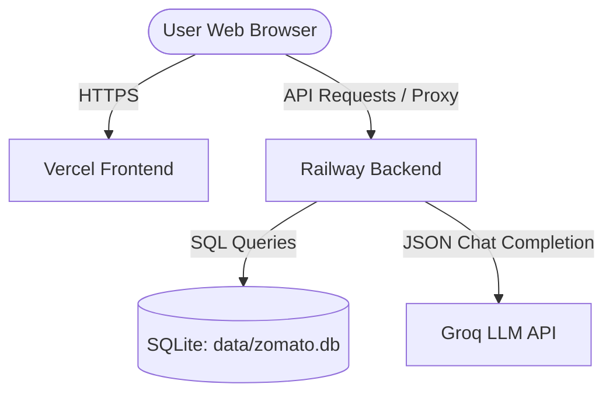

# Deployment Plan: TasteAI Recommendation System

This plan outlines the steps required to deploy the **TasteAI Backend** on **Railway** and the **TasteAI Frontend** on **Vercel**.

---

## 🏗️ Architecture Overview



* **Frontend**: Vanilla HTML/JS/CSS hosted on **Vercel** as a static site.
* **Backend**: FastAPI (Python) web server hosted on **Railway**, connecting to the Groq API and querying the pre-built local SQLite database (`data/zomato.db`).

---

## 🛠️ Step 1: Prepare the Codebase for Git

Because the SQLite database (`data/zomato.db`) contains the Zomato dataset (approx. 23MB) and is read-only for recommendations, we need to commit it to the repository so the Railway backend has immediate access to it.

1. **Commit the Database**:
   Force-add the database to Git even though it matches the ignored rules in `.gitignore`:
   ```bash
   git add -f data/zomato.db
   ```
2. **Stage and Commit all Changes**:
   ```bash
   git add requirements.txt docs/api-documentation.md docs/deployment-plan.md
   git commit -m "chore: prepare repository for Railway and Vercel deployment"
   git push origin main
   ```

---

## 🚀 Step 2: Deploy the Backend on Railway

Railway is ideal for hosting the FastAPI Python server. It will automatically detect the Python environment and build/run the app using the `requirements.txt` file.

### 1. Create a New Service
1. Log in to [Railway.app](https://railway.app/).
2. Click **New Project** $\rightarrow$ **Deploy from GitHub repo**.
3. Select your repository (`TasteAI`).
4. Select the `main` branch.

### 2. Configure Environment Variables
In the **Variables** tab of your new Railway service, add the following:

| Variable Name | Value | Description |
| :--- | :--- | :--- |
| `PORT` | `8000` | Port uvicorn will bind to (Railway overrides this automatically, but good for local/dev fallback) |
| `GROQ_API_KEY` | `gsk_...` | **Required**: Your Groq API key |
| `GROQ_MODEL` | `llama-3.3-70b-versatile` | The model to use for recommendations |
| `DB_PATH` | `data/zomato.db` | Relative path to the sqlite database in the repo |

### 3. Verify Start Command
Railway will attempt to run the start script automatically. To ensure it runs FastAPI correctly, go to **Settings** $\rightarrow$ **Deploy** $\rightarrow$ **Start Command** and configure it to:
```bash
uvicorn src.api:app --host 0.0.0.0 --port $PORT
```

### 4. Enable Public Domain
1. In the service's **Settings** tab, go to **Environment** $\rightarrow$ **Domains**.
2. Click **Generate Domain** (e.g., `taste-ai-production.up.railway.app`).
3. Copy this URL — you will need it for the frontend configuration.

---

## 🌐 Step 3: Deploy the Frontend on Vercel

Vercel provides fast static site hosting. To make the frontend communicate with the Railway backend without CORS issues or editing Javascript URLs, we will use Vercel's **Rewrites (Proxying)** feature.

### 1. Add `vercel.json` Configuration
Create a file named `vercel.json` in the root of the project to tell Vercel to route all `/recommend`, `/cities`, and `/health` requests to your Railway backend:

```json
{
  "cleanUrls": true,
  "rewrites": [
    {
      "source": "/recommend",
      "destination": "https://YOUR-RAILWAY-DOMAIN.up.railway.app/recommend"
    },
    {
      "source": "/cities",
      "destination": "https://YOUR-RAILWAY-DOMAIN.up.railway.app/cities"
    },
    {
      "source": "/health",
      "destination": "https://YOUR-RAILWAY-DOMAIN.up.railway.app/health"
    }
  ]
}
```
*(Replace `https://YOUR-RAILWAY-DOMAIN.up.railway.app` with the actual public URL generated by Railway in Step 2.4).*

### 2. Create the Vercel Project
1. Log in to [Vercel.com](https://vercel.com/).
2. Click **Add New** $\rightarrow$ **Project**.
3. Import your GitHub repository (`TasteAI`).
4. Configure the Build and Development settings:
   - **Framework Preset**: `Other` (or `None` for static websites).
   - **Root Directory**: `static` (This ensures Vercel serves the HTML, CSS, and JS files from your `static/` directory as the website homepage).
5. Click **Deploy**.

---

## 🧪 Step 4: Verification and Testing

Once both services are deployed:

1. **Verify Backend Status**:
   Visit `https://YOUR-RAILWAY-DOMAIN.up.railway.app/health` in your browser. It should return `{"status": "ok"}`.
2. **Verify Frontend UI**:
   Open your generated Vercel URL (e.g. `https://taste-ai.vercel.app`). The dropdown lists and recommendation submits should seamlessly route requests to Railway and load responses.
