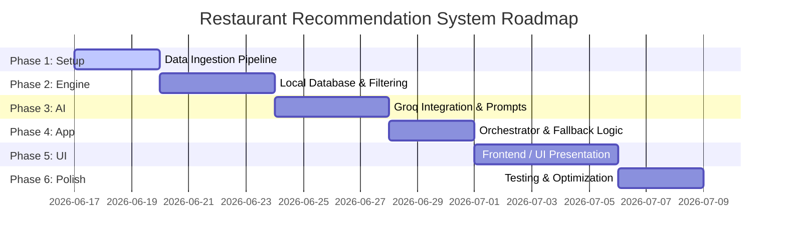

# Phase-Wise Implementation Plan: AI-Powered Restaurant Recommendation System

This document outlines the step-by-step roadmap to build, test, and deploy the AI-powered restaurant recommendation system, leveraging the **Groq API** and the **Hugging Face Zomato Dataset**.

---

## 📅 Roadmap Overview

---

## 🛠️ Detailed Phases

### Phase 1: Environment Setup & Data Ingestion Pipeline
Set up the core project environment and build the pipeline to download the dataset.

* **Tasks:**
  1. Initialize the project workspace (Node.js/TypeScript).
  2. Install core dependencies:
     * Database driver: `better-sqlite3` or `sqlite` (or `pandas` if using Python).
     * API Clients: `@groq/groq-sdk` or `openai` (for Groq client library).
     * Environmental variables helper: `dotenv`.
  3. Create the `DataIngestionService`:
     * Script to fetch the Zomato restaurant recommendation dataset from Hugging Face (`ManikaSaini/zomato-restaurant-recommendation`).
     * Parse the raw CSV/Parquet file from Hugging Face.
* **Validation / Milestone:** 
  * Running `npm run ingest` downloads the dataset and parses it successfully without memory issues.

---

### Phase 2: Core Database & Filtering Engine
Design the data schema and implement local filtering to prevent passing too many tokens to Groq.

* **Tasks:**
  1. Create database indices for the `restaurants` table on `city`, `average_cost`, and `rating`.
  2. Write the `RestaurantFilteringEngine` (Python module):
     * Define budget tier constants: `low` (≤ ₹300), `medium` (≤ ₹800), `high` (no limit).
     * Traditional search functions to filter restaurants by Location/City (`city`), Cuisine matching, budget tier (`budget_tier`), and Rating thresholds.
     * Limit candidate outputs to the top 15 results sorted by rating and review count.
* **Validation / Milestone:**
  * Querying `RestaurantFilteringEngine.get_candidates("Banashankari", ["Cafe"], budget_tier="low")` returns a maximum of 15 relevant records with average cost ≤ 300.

---

### Phase 3: Groq LLM Integration Service
Connect to Groq and construct prompts that output structured JSON matching the architecture model.

* **Tasks:**
  1. Configure `Groq` client instance using environment variable keys (`GROQ_API_KEY`).
  2. Select model (e.g., `llama-3.3-70b-versatile` or `mixtral-8x7b-32768` for fast JSON outputs).
  3. Develop the System Instructions and User Prompt template:
     * Inject candidate restaurants dynamically as structured JSON objects.
     * Direct the model to output **only** valid JSON matching `AIRecommendationResponse`.
  4. Implement JSON output enforcement using Groq's JSON mode configuration (`response_format: { type: "json_object" }`).
* **Validation / Milestone:**
  * Script testing Groq API returns recommendations containing correct structure, rank, suitability score, and natural language explanations.

---

### Phase 4: Orchestrator & Application Layer
Tie the filtering engine and LLM service together, adding reliability features.

* **Tasks:**
  1. Implement `RecommendationOrchestrator`:
     * Accepts request (including budget tier) $\rightarrow$ Coordinates Filtering (resolves tier to cost cap) $\rightarrow$ Invokes Groq LLM $\rightarrow$ Returns UI Payload.
  2. Implement local in-memory caching (or Redis cache) to save recommendations for identical queries for 1 hour.
  3. Implement **Graceful Degradation / Fallback Mode**:
     * If the Groq API fails or rate limits, fallback to returning top database search matches sorted strictly by rating, displaying a message: *"AI reasoning is currently offline, displaying best ratings."*
* **Validation / Milestone:**
  * Temporarily cutting off the internet or changing the Groq API key to an invalid value causes the engine to return standard ratings-based results smoothly.

---

### Phase 5: Front-End UI / Presentation Layer
Develop a responsive user interface where users can select parameters and review recommendations.

* **Tasks:**
  1. Set up a simple dashboard frontend (React/Next.js, Vite, or vanilla HTML/CSS).
  2. Implement forms:
     * Search bars for city, dropdowns for cuisine, budget buttons, and minimum rating slider.
     * Textbox for "additional vibe/preferences" (e.g. family-friendly, roof-top).
  3. Design recommendation cards showing:
     * Restaurant name, cuisines tag pill, cost tier, ratings star display.
     * Expanding/Collapsible AI explanation text.
* **Validation / Milestone:**
  * A user can input preferences on the webpage, hit "Get Recommendations", view loading indicators, and see structured results render dynamically.

---

### Phase 6: Performance Optimization & Testing
Polish the user experience and ensure prompt consistency.

* **Tasks:**
  1. Profile prompt size and adjust the number of filtered candidate restaurants injected (optimize costs/latency).
  2. Write unit tests for the database queries and filtering engine.
  3. Secure environment variables against client exposure.
* **Validation / Milestone:**
  * Application fully tested, environment credentials secured, and production bundle builds successfully.
